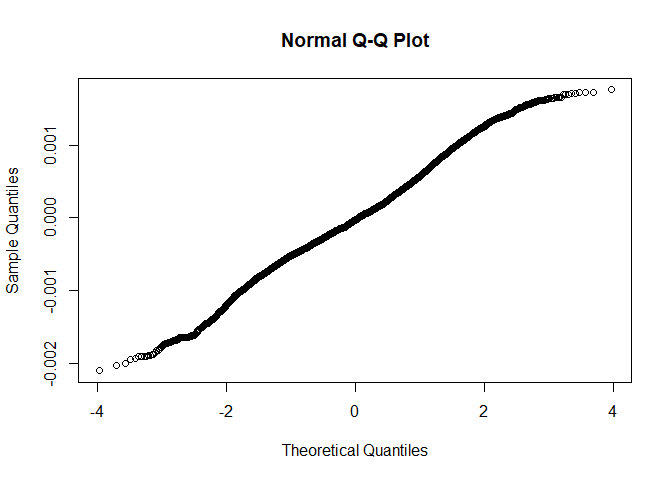
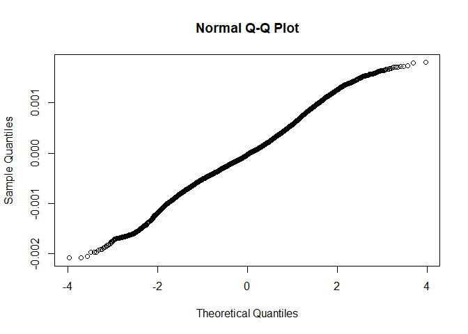

R Notebook for Milkbot DECAY
================

- [Raw Data import](#raw-data-import)
- [Data manipulation](#data-manipulation)
- [Model](#model)
  - [Base model](#base-model)
  - [Full model](#full-model)
  - [Comparison of baseline and nested
    model](#comparison-of-baseline-and-nested-model)
  - [Least square means](#least-square-means)

# Raw Data import

``` r
source('../DataImport.R')
```

# Data manipulation

``` r
#We inspect the quantile ranges
scale_this <- function(x){
  (x - mean(x, na.rm=F)) / sd(x, na.rm=F)
}

quantile(AllDataRaw$DaysPregnant)
```

    ##   0%  25%  50%  75% 100% 
    ##  150  275  278  283  297

``` r
AllData <- AllDataRaw %>% dplyr::filter(
                            LactationNumber == 1,
                            # DaysPregnant <= 283, #We drop all above 75th percentile because no interest at this stage, missing inseminations?
                            M305 > 0 #No missing M305 calculations
                            ) %>% 
                          dplyr::mutate(
                            Date  = mdy_hms(Date), #reformat ordering date
                            Year = year(mdy_hms(CalvingDate)),
                            Month = month(mdy_hms(CalvingDate)),
                            Age = scale(as.numeric(difftime(mdy_hms(CalvingDate), mdy_hms(BirthDate), units = "days"))),
                            DaysPregnantQuantile = case_when(
                              DaysPregnant < 243 ~ "0-1th Pct",
                              DaysPregnant < 267 ~ "1-5th Pct",
                              DaysPregnant < 275 ~ "5-25th Pct",
                              DaysPregnant < 283 ~ "25-75th Pct",
                              TRUE ~ "75-100 Pct"
                              )
                            ) %>%
                          dplyr::arrange(
                            HerdId,
                            AnimalId,
                            Date
                          ) %>%
                          dplyr::group_by(
                                          AnimalId,
                                          HerdId,
                                          DaysPregnantQuantile,
                                          Year,
                                          Month,
                                          CalvingDate,
                                          BirthDate
                                          ) %>% 
                          summarise(
                            Value = as.numeric(last(Decay)),
                            Age = as.numeric(last(Age))
                            ) %>% 
                          tidyr::drop_na() 
```

    ## `summarise()` has grouped output by 'AnimalId', 'HerdId', 'DaysPregnantQuantile', 'Year', 'Month', 'CalvingDate'. You can override using the `.groups`
    ## argument.

``` r
AllData %>% ungroup %>% count(DaysPregnantQuantile)    
```

    ## # A tibble: 5 × 2
    ##   DaysPregnantQuantile     n
    ##   <chr>                <int>
    ## 1 0-1th Pct              129
    ## 2 1-5th Pct              501
    ## 3 25-75th Pct           7214
    ## 4 5-25th Pct            2231
    ## 5 75-100 Pct            3657

# Model

## Base model

``` r
baseline <- lmer(
                  Value ~ 1 +  (1 | HerdId), 
                  data = AllData,
                  REML = FALSE
                  )
qqnorm(residuals(baseline, type = 'pearson'))
```

<!-- -->

## Full model

``` r
GLM <- lmer(
                  Value ~ 
                    DaysPregnantQuantile + Year + Month + DaysPregnantQuantile + Age
                     +  (1 | HerdId),
                  data = AllData,
                  REML = FALSE
                  )
qqnorm(residuals(GLM))
```

<!-- -->

``` r
summary(GLM)
```

    ## Linear mixed model fit by maximum likelihood . t-tests use Satterthwaite's method ['lmerModLmerTest']
    ## Formula: Value ~ DaysPregnantQuantile + Year + Month + DaysPregnantQuantile +      Age + (1 | HerdId)
    ##    Data: AllData
    ## 
    ##       AIC       BIC    logLik  deviance  df.resid 
    ## -165377.9 -165302.6   82699.0 -165397.9     13722 
    ## 
    ## Scaled residuals: 
    ##     Min      1Q  Median      3Q     Max 
    ## -3.5884 -0.6351 -0.0567  0.6009  3.0976 
    ## 
    ## Random effects:
    ##  Groups   Name        Variance  Std.Dev. 
    ##  HerdId   (Intercept) 4.771e-08 0.0002184
    ##  Residual             3.381e-07 0.0005814
    ## Number of obs: 13732, groups:  HerdId, 89
    ## 
    ## Fixed effects:
    ##                                   Estimate Std. Error         df t value Pr(>|t|)    
    ## (Intercept)                      3.195e-02  9.148e-03  1.316e+04   3.493 0.000480 ***
    ## DaysPregnantQuantile1-5th Pct    4.880e-05  5.843e-05  1.372e+04   0.835 0.403670    
    ## DaysPregnantQuantile25-75th Pct  1.276e-04  5.309e-05  1.373e+04   2.404 0.016229 *  
    ## DaysPregnantQuantile5-25th Pct   1.200e-04  5.400e-05  1.373e+04   2.222 0.026267 *  
    ## DaysPregnantQuantile75-100 Pct   1.301e-04  5.331e-05  1.373e+04   2.441 0.014648 *  
    ## Year                            -1.519e-05  4.536e-06  1.316e+04  -3.349 0.000814 ***
    ## Month                           -1.183e-05  1.468e-06  1.371e+04  -8.061 8.19e-16 ***
    ## Age                              2.961e-05  5.845e-06  1.373e+04   5.067 4.10e-07 ***
    ## ---
    ## Signif. codes:  0 '***' 0.001 '**' 0.01 '*' 0.05 '.' 0.1 ' ' 1
    ## 
    ## Correlation of Fixed Effects:
    ##             (Intr) DPQ1-P DPQ25P DPQ5-P DPQ75P Year   Month 
    ## DysPrgQ1-5P -0.006                                          
    ## DysPQ25-75P -0.009  0.885                                   
    ## DysPrQ5-25P -0.006  0.869  0.964                            
    ## DyPQ75-100P -0.008  0.878  0.973  0.955                     
    ## Year        -1.000  0.001  0.003  0.000  0.002              
    ## Month       -0.215 -0.007  0.005  0.002  0.001  0.213       
    ## Age         -0.048 -0.019 -0.010  0.000 -0.024  0.048  0.010

## Comparison of baseline and nested model

``` r
anova(GLM,baseline, test="Chisq")
```

    ## Data: AllData
    ## Models:
    ## baseline: Value ~ 1 + (1 | HerdId)
    ## GLM: Value ~ DaysPregnantQuantile + Year + Month + DaysPregnantQuantile + Age + (1 | HerdId)
    ##          npar     AIC     BIC logLik deviance Chisq Df Pr(>Chisq)    
    ## baseline    3 -165281 -165259  82644  -165287                        
    ## GLM        10 -165378 -165303  82699  -165398 110.6  7  < 2.2e-16 ***
    ## ---
    ## Signif. codes:  0 '***' 0.001 '**' 0.01 '*' 0.05 '.' 0.1 ' ' 1

## Least square means

``` r
emm_options(pbkrtest.limit = 10880)
LSMs<-emmeans::emmeans(GLM, pairwise~DaysPregnantQuantile, type = "response", adjust="sidak", glhargs=list())
```

    ## Note: D.f. calculations have been disabled because the number of observations exceeds 10880.
    ## To enable adjustments, add the argument 'pbkrtest.limit = 13732' (or larger)
    ## [or, globally, 'set emm_options(pbkrtest.limit = 13732)' or larger];
    ## but be warned that this may result in large computation time and memory use.

    ## Note: D.f. calculations have been disabled because the number of observations exceeds 3000.
    ## To enable adjustments, add the argument 'lmerTest.limit = 13732' (or larger)
    ## [or, globally, 'set emm_options(lmerTest.limit = 13732)' or larger];
    ## but be warned that this may result in large computation time and memory use.

``` r
multcomp::cld(LSMs$emmeans, alpha=0.05, Letters=letters, adjust="sidak")
```

    ##  DaysPregnantQuantile  emmean       SE  df asymp.LCL asymp.UCL .group
    ##  0-1th Pct            0.00125 5.74e-05 Inf   0.00110   0.00140  ab   
    ##  1-5th Pct            0.00130 3.55e-05 Inf   0.00121   0.00139  a    
    ##  5-25th Pct           0.00137 2.71e-05 Inf   0.00130   0.00144  ab   
    ##  25-75th Pct          0.00138 2.51e-05 Inf   0.00131   0.00144   b   
    ##  75-100 Pct           0.00138 2.58e-05 Inf   0.00131   0.00145   b   
    ## 
    ## Degrees-of-freedom method: asymptotic 
    ## Confidence level used: 0.95 
    ## Conf-level adjustment: sidak method for 5 estimates 
    ## P value adjustment: sidak method for 10 tests 
    ## significance level used: alpha = 0.05 
    ## NOTE: If two or more means share the same grouping symbol,
    ##       then we cannot show them to be different.
    ##       But we also did not show them to be the same.
