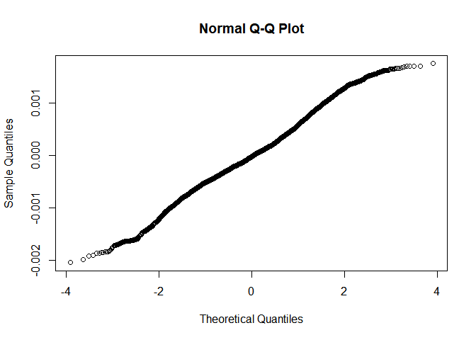

R Notebook
================

-   [Raw Data import](#raw-data-import)
-   [Data manipulation](#data-manipulation)
-   [Model M305](#model-m305)
    -   [Base model](#base-model)
    -   [Full model](#full-model)
    -   [Comparison of baseline and nested model](#comparison-of-baseline-and-nested-model)
    -   [Least square means](#least-square-means)

Raw Data import
===============

``` r
source('../DataImport.R')
```

Data manipulation
=================

``` r
#We inspect the quantile ranges

quantile(AllDataRaw$DaysPregnant)
```

    ##   0%  25%  50%  75% 100% 
    ##  150  275  278  283  297

``` r
AllData <- AllDataRaw %>% dplyr::filter(
                            LactationNumber == 1,
                            DaysPregnant <= 283, #We drop all above 75th percentile because no interest at this stage, missing inseminations?
                            M305 > 0 #No missing M305 calculations
                            ) %>% 
                          dplyr::mutate(
                            Date  = mdy_hms(Date), #reformat ordering date
                            Year = year(mdy_hms(CalvingDate)),
                            Month = month(mdy_hms(CalvingDate)),
                            DaysPregnantQuantile = case_when(
                              DaysPregnant < 275 ~ "0-25th Pct",
                              TRUE ~ "25-75 Pct"
                              )
                            ) %>%
                          dplyr::arrange(
                            HerdId,
                            AnimalId,
                            Date
                          ) %>%
                          dplyr::group_by(
                                          AnimalId,
                                          HerdId,
                                          DaysPregnantQuantile,
                                          Year,
                                          Month,
                                          CalvingDate
                                          ) %>% 
                          summarise(
                            Value = as.integer(last(Decay))
                            )
```

Model M305
==========

Base model
----------

``` r
baseline <- lmer(
                  Value ~ 1 +  (1 | HerdId), 
                  data = AllData
                  )
qqnorm(residuals(baseline, type = 'pearson'))
```



Full model
----------

``` r
GLM <- lmer(
                  Value ~ 
                    DaysPregnantQuantile + Year + Month
                     +  (1 | HerdId),
                  data = AllData
                  )
qqnorm(residuals(GLM))
```


Comparison of baseline and nested model
---------------------------------------

``` r
anova(GLM,baseline, test="Chisq")
```

    ## refitting model(s) with ML (instead of REML)

    ## Data: AllData
    ## Models:
    ## baseline: Value ~ 1 + (1 | HerdId)
    ## GLM: Value ~ DaysPregnantQuantile + Year + Month + (1 | HerdId)
    ##          Df  AIC  BIC logLik deviance Chisq Chi Df Pr(>Chisq)
    ## baseline  3 -Inf -Inf    Inf     -Inf                        
    ## GLM       6 -Inf -Inf    Inf     -Inf            3

Least square means
------------------

``` r
lsmeans(GLM, pairwise~DaysPregnantQuantile, type = "response", adjust="tukey")
```

    ## Warning in vcov.merMod(object, correlation = FALSE): Computed variance-covariance matrix problem: not a positive definite matrix;
    ## returning NA matrix

    ## Note: D.f. calculations have been disabled because the number of observations exceeds 3000.
    ## To enable adjustments, set emm_options(pbkrtest.limit = 10881) or larger,
    ## but be warned that this may result in large computation time and memory use.

    ## Note: D.f. calculations have been disabled because the number of observations exceeds 3000.
    ## To enable adjustments, set emm_options(lmerTest.limit = 10881) or larger,
    ## but be warned that this may result in large computation time and memory use.

    ## $lsmeans
    ##  DaysPregnantQuantile lsmean SE  df asymp.LCL asymp.UCL
    ##  0-25th Pct                0 NA Inf        NA        NA
    ##  25-75 Pct                 0 NA Inf        NA        NA
    ## 
    ## Degrees-of-freedom method: asymptotic 
    ## Confidence level used: 0.95 
    ## 
    ## $contrasts
    ##  contrast               estimate SE  df z.ratio p.value
    ##  0-25th Pct - 25-75 Pct        0 NA Inf NA      NA
