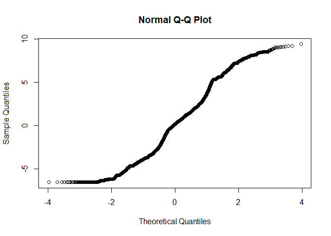
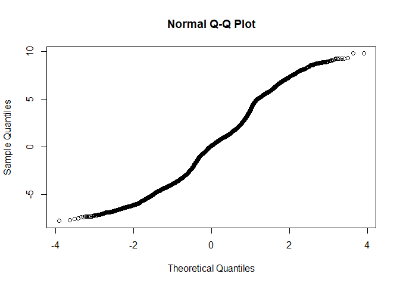

R Notebook for Milkbot RAMP
================

- [Raw Data import](#raw-data-import)
- [Data manipulation](#data-manipulation)
- [Model](#model)
  - [Base model](#base-model)
  - [Full model](#full-model)
  - [Comparison of baseline and nested
    model](#comparison-of-baseline-and-nested-model)
  - [Least square means](#least-square-means)

# Raw Data import

``` r
source('../DataImport.R')
```

# Data manipulation

``` r
#We inspect the quantile ranges
scale_this <- function(x){
  (x - mean(x, na.rm=F)) / sd(x, na.rm=F)
}

quantile(AllDataRaw$DaysPregnant)
```

    ##   0%  25%  50%  75% 100% 
    ##  150  275  278  283  297

``` r
AllData <- AllDataRaw %>% dplyr::filter(
                            LactationNumber == 1,
                            DaysPregnant <= 283, #We drop all above 75th percentile because no interest at this stage, missing inseminations?
                            M305 > 0 #No missing M305 calculations
                            ) %>% 
                          dplyr::mutate(
                            Date  = mdy_hms(Date), #reformat ordering date
                            Year = year(mdy_hms(CalvingDate)),
                            Month = month(mdy_hms(CalvingDate)),
                            Age = scale(as.numeric(difftime(mdy_hms(CalvingDate), mdy_hms(BirthDate), units = "days"))),
                            DaysPregnantQuantile = case_when(
                              DaysPregnant < 243 ~ "0-1th Pct",
                              DaysPregnant < 267 ~ "1-5th Pct",
                              DaysPregnant < 275 ~ "5-25th Pct",
                              TRUE ~ "25-75 Pct"
                              )
                            ) %>%
                          dplyr::arrange(
                            HerdId,
                            AnimalId,
                            Date
                          ) %>%
                          dplyr::group_by(
                                          AnimalId,
                                          HerdId,
                                          DaysPregnantQuantile,
                                          Year,
                                          Month,
                                          CalvingDate,
                                          BirthDate
                                          ) %>% 
                          summarise(
                            Value = as.numeric(last(Ramp)),
                            Age = as.numeric(last(Age))
                            ) %>% 
                          tidyr::drop_na() 
```

    ## `summarise()` has grouped output by 'AnimalId', 'HerdId',
    ## 'DaysPregnantQuantile', 'Year', 'Month', 'CalvingDate'. You can override using
    ## the `.groups` argument.

``` r
AllData %>% ungroup %>% count(DaysPregnantQuantile)    
```

    ## # A tibble: 4 × 2
    ##   DaysPregnantQuantile     n
    ##   <chr>                <int>
    ## 1 0-1th Pct              129
    ## 2 1-5th Pct              501
    ## 3 25-75 Pct             8019
    ## 4 5-25th Pct            2231

# Model

## Base model

``` r
baseline <- lmer(
                  Value ~ 1 +  (1 | HerdId), 
                  data = AllData,
                  REML = FALSE
                  )
qqnorm(residuals(baseline, type = 'pearson'))
```

<!-- -->

## Full model

``` r
GLM <- lmer(
                  Value ~ 
                    DaysPregnantQuantile + Year + Month + DaysPregnantQuantile + Age
                     +  (1 | HerdId),
                  data = AllData,
                  REML = FALSE
                  )
qqnorm(residuals(GLM))
```

<!-- -->

``` r
summary(GLM)
```

    ## Linear mixed model fit by maximum likelihood . t-tests use Satterthwaite's
    ##   method [lmerModLmerTest]
    ## Formula: Value ~ DaysPregnantQuantile + Year + Month + DaysPregnantQuantile +  
    ##     Age + (1 | HerdId)
    ##    Data: AllData
    ## 
    ##      AIC      BIC   logLik deviance df.resid 
    ##  58793.9  58859.6 -29388.0  58775.9    10871 
    ## 
    ## Scaled residuals: 
    ##      Min       1Q   Median       3Q      Max 
    ## -2.17717 -0.84685  0.03264  0.56787  2.74597 
    ## 
    ## Random effects:
    ##  Groups   Name        Variance Std.Dev.
    ##  HerdId   (Intercept)  1.236   1.112   
    ##  Residual             12.767   3.573   
    ## Number of obs: 10880, groups:  HerdId, 89
    ## 
    ## Fixed effects:
    ##                                  Estimate Std. Error         df t value
    ## (Intercept)                     8.761e+02  6.321e+01  9.750e+03  13.860
    ## DaysPregnantQuantile1-5th Pct   2.103e-02  3.623e-01  1.078e+04   0.058
    ## DaysPregnantQuantile25-75 Pct  -4.374e-01  3.303e-01  1.057e+04  -1.324
    ## DaysPregnantQuantile5-25th Pct -2.729e-01  3.360e-01  1.060e+04  -0.812
    ## Year                           -4.199e-01  3.134e-02  9.751e+03 -13.397
    ## Month                           2.210e-02  1.020e-02  1.087e+04   2.168
    ## Age                            -1.602e-01  4.086e-02  1.084e+04  -3.921
    ##                                Pr(>|t|)    
    ## (Intercept)                     < 2e-16 ***
    ## DaysPregnantQuantile1-5th Pct    0.9537    
    ## DaysPregnantQuantile25-75 Pct    0.1855    
    ## DaysPregnantQuantile5-25th Pct   0.4168    
    ## Year                            < 2e-16 ***
    ## Month                            0.0302 *  
    ## Age                            8.88e-05 ***
    ## ---
    ## Signif. codes:  0 '***' 0.001 '**' 0.01 '*' 0.05 '.' 0.1 ' ' 1
    ## 
    ## Correlation of Fixed Effects:
    ##             (Intr) DPQ1-P DPQ25P DPQ5-P Year   Month 
    ## DysPrgQ1-5P -0.011                                   
    ## DysPQ25-75P -0.014  0.888                            
    ## DysPrQ5-25P -0.010  0.871  0.965                     
    ## Year        -1.000  0.006  0.009  0.005              
    ## Month       -0.216 -0.007  0.005  0.002  0.215       
    ## Age         -0.061 -0.025 -0.018 -0.004  0.061  0.008

## Comparison of baseline and nested model

``` r
anova(GLM,baseline, test="Chisq")
```

    ## Data: AllData
    ## Models:
    ## baseline: Value ~ 1 + (1 | HerdId)
    ## GLM: Value ~ DaysPregnantQuantile + Year + Month + DaysPregnantQuantile + Age + (1 | HerdId)
    ##          npar   AIC   BIC logLik deviance Chisq Df Pr(>Chisq)    
    ## baseline    3 59006 59028 -29500    59000                        
    ## GLM         9 58794 58860 -29388    58776 224.3  6  < 2.2e-16 ***
    ## ---
    ## Signif. codes:  0 '***' 0.001 '**' 0.01 '*' 0.05 '.' 0.1 ' ' 1

## Least square means

``` r
emm_options(pbkrtest.limit = 10880)
LSMs<-emmeans::emmeans(GLM, pairwise~DaysPregnantQuantile, type = "response", adjust="sidak", glhargs=list())
multcomp::cld(LSMs$emmeans, alpha=0.05, Letters=letters, adjust="sidak")
```

    ##  DaysPregnantQuantile emmean    SE   df lower.CL upper.CL .group
    ##  25-75 Pct              29.3 0.133   93     29.0     29.7  a    
    ##  5-25th Pct             29.5 0.148  144     29.1     29.9  ab   
    ##  0-1th Pct              29.8 0.348 2922     28.9     30.7  ab   
    ##  1-5th Pct              29.8 0.204  521     29.3     30.3   b   
    ## 
    ## Degrees-of-freedom method: kenward-roger 
    ## Confidence level used: 0.95 
    ## Conf-level adjustment: sidak method for 4 estimates 
    ## P value adjustment: sidak method for 6 tests 
    ## significance level used: alpha = 0.05 
    ## NOTE: If two or more means share the same grouping symbol,
    ##       then we cannot show them to be different.
    ##       But we also did not show them to be the same.
