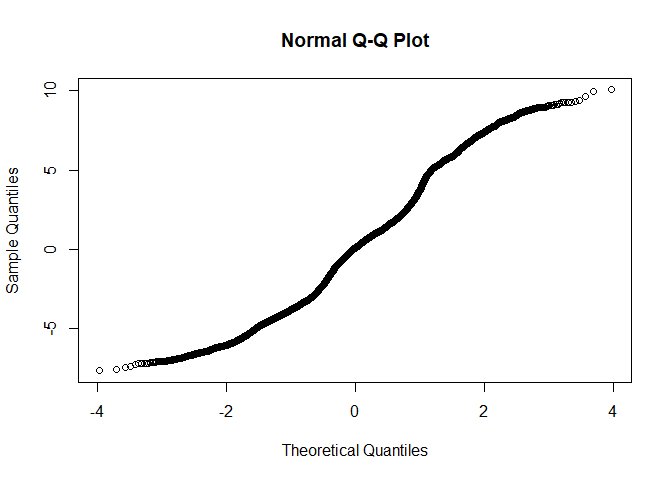

R Notebook for Milkbot RAMP
================

- [Raw Data import](#raw-data-import)
- [Data manipulation](#data-manipulation)
- [Model](#model)
  - [Base model](#base-model)
  - [Full model](#full-model)
  - [Comparison of baseline and nested
    model](#comparison-of-baseline-and-nested-model)
  - [Least square means](#least-square-means)

# Raw Data import

``` r
source('../DataImport.R')
```

# Data manipulation

``` r
#We inspect the quantile ranges
scale_this <- function(x){
  (x - mean(x, na.rm=F)) / sd(x, na.rm=F)
}

quantile(AllDataRaw$DaysPregnant)
```

    ##   0%  25%  50%  75% 100% 
    ##  150  275  278  283  297

``` r
AllData <- AllDataRaw %>% dplyr::filter(
                            LactationNumber == 1,
                            # DaysPregnant <= 283, #We drop all above 75th percentile because no interest at this stage, missing inseminations?
                            M305 > 0 #No missing M305 calculations
                            ) %>% 
                          dplyr::mutate(
                            Date  = mdy_hms(Date), #reformat ordering date
                            Year = year(mdy_hms(CalvingDate)),
                            Month = month(mdy_hms(CalvingDate)),
                            Age = scale(as.numeric(difftime(mdy_hms(CalvingDate), mdy_hms(BirthDate), units = "days"))),
                            DaysPregnantQuantile = case_when(
                              DaysPregnant < 243 ~ "0-1th Pct",
                              DaysPregnant < 267 ~ "1-5th Pct",
                              DaysPregnant < 275 ~ "5-25th Pct",
                              DaysPregnant < 283 ~ "25-75th Pct",
                              TRUE ~ "75-100 Pct"
                              )
                            ) %>%
                          dplyr::arrange(
                            HerdId,
                            AnimalId,
                            Date
                          ) %>%
                          dplyr::group_by(
                                          AnimalId,
                                          HerdId,
                                          DaysPregnantQuantile,
                                          Year,
                                          Month,
                                          CalvingDate,
                                          BirthDate
                                          ) %>% 
                          summarise(
                            Value = as.numeric(last(Ramp)),
                            Age = as.numeric(last(Age))
                            ) %>% 
                          tidyr::drop_na() 
```

    ## `summarise()` has grouped output by 'AnimalId', 'HerdId', 'DaysPregnantQuantile', 'Year', 'Month', 'CalvingDate'. You can override using the `.groups`
    ## argument.

``` r
AllData %>% ungroup %>% count(DaysPregnantQuantile)    
```

    ## # A tibble: 5 × 2
    ##   DaysPregnantQuantile     n
    ##   <chr>                <int>
    ## 1 0-1th Pct              129
    ## 2 1-5th Pct              501
    ## 3 25-75th Pct           7214
    ## 4 5-25th Pct            2231
    ## 5 75-100 Pct            3657

# Model

## Base model

``` r
baseline <- lmer(
                  Value ~ 1 +  (1 | HerdId), 
                  data = AllData,
                  REML = FALSE
                  )
qqnorm(residuals(baseline, type = 'pearson'))
```

<!-- -->

## Full model

``` r
GLM <- lmer(
                  Value ~ 
                    DaysPregnantQuantile + Year + Month + DaysPregnantQuantile + Age
                     +  (1 | HerdId),
                  data = AllData,
                  REML = FALSE
                  )
qqnorm(residuals(GLM))
```

<!-- -->

``` r
summary(GLM)
```

    ## Linear mixed model fit by maximum likelihood . t-tests use Satterthwaite's method ['lmerModLmerTest']
    ## Formula: Value ~ DaysPregnantQuantile + Year + Month + DaysPregnantQuantile +      Age + (1 | HerdId)
    ##    Data: AllData
    ## 
    ##      AIC      BIC   logLik deviance df.resid 
    ##  73969.2  74044.4 -36974.6  73949.2    13722 
    ## 
    ## Scaled residuals: 
    ##      Min       1Q   Median       3Q      Max 
    ## -2.16259 -0.85395  0.02409  0.56906  2.83848 
    ## 
    ## Random effects:
    ##  Groups   Name        Variance Std.Dev.
    ##  HerdId   (Intercept)  1.275   1.129   
    ##  Residual             12.575   3.546   
    ## Number of obs: 13732, groups:  HerdId, 89
    ## 
    ## Fixed effects:
    ##                                   Estimate Std. Error         df t value Pr(>|t|)    
    ## (Intercept)                      8.738e+02  5.558e+01  1.263e+04  15.723  < 2e-16 ***
    ## DaysPregnantQuantile1-5th Pct    1.443e-02  3.561e-01  1.373e+04   0.041  0.96768    
    ## DaysPregnantQuantile25-75th Pct -4.695e-01  3.235e-01  1.372e+04  -1.451  0.14667    
    ## DaysPregnantQuantile5-25th Pct  -2.957e-01  3.290e-01  1.372e+04  -0.899  0.36883    
    ## DaysPregnantQuantile75-100 Pct  -4.609e-01  3.248e-01  1.373e+04  -1.419  0.15597    
    ## Year                            -4.187e-01  2.756e-02  1.263e+04 -15.196  < 2e-16 ***
    ## Month                            2.439e-02  8.949e-03  1.372e+04   2.726  0.00642 ** 
    ## Age                             -1.429e-01  3.560e-02  1.370e+04  -4.014 6.01e-05 ***
    ## ---
    ## Signif. codes:  0 '***' 0.001 '**' 0.01 '*' 0.05 '.' 0.1 ' ' 1
    ## 
    ## Correlation of Fixed Effects:
    ##             (Intr) DPQ1-P DPQ25P DPQ5-P DPQ75P Year   Month 
    ## DysPrgQ1-5P -0.007                                          
    ## DysPQ25-75P -0.009  0.885                                   
    ## DysPrQ5-25P -0.007  0.869  0.964                            
    ## DyPQ75-100P -0.008  0.878  0.973  0.955                     
    ## Year        -1.000  0.002  0.004  0.001  0.003              
    ## Month       -0.213 -0.007  0.006  0.003  0.001  0.212       
    ## Age         -0.049 -0.020 -0.010  0.000 -0.024  0.049  0.010

## Comparison of baseline and nested model

``` r
anova(GLM,baseline, test="Chisq")
```

    ## Data: AllData
    ## Models:
    ## baseline: Value ~ 1 + (1 | HerdId)
    ## GLM: Value ~ DaysPregnantQuantile + Year + Month + DaysPregnantQuantile + Age + (1 | HerdId)
    ##          npar   AIC   BIC logLik deviance  Chisq Df Pr(>Chisq)    
    ## baseline    3 74245 74267 -37119    74239                         
    ## GLM        10 73969 74044 -36975    73949 289.52  7  < 2.2e-16 ***
    ## ---
    ## Signif. codes:  0 '***' 0.001 '**' 0.01 '*' 0.05 '.' 0.1 ' ' 1

## Least square means

``` r
emm_options(pbkrtest.limit = 10880)
LSMs<-emmeans::emmeans(GLM, pairwise~DaysPregnantQuantile, type = "response", adjust="sidak", glhargs=list())
```

    ## Note: D.f. calculations have been disabled because the number of observations exceeds 10880.
    ## To enable adjustments, add the argument 'pbkrtest.limit = 13732' (or larger)
    ## [or, globally, 'set emm_options(pbkrtest.limit = 13732)' or larger];
    ## but be warned that this may result in large computation time and memory use.

    ## Note: D.f. calculations have been disabled because the number of observations exceeds 3000.
    ## To enable adjustments, add the argument 'lmerTest.limit = 13732' (or larger)
    ## [or, globally, 'set emm_options(lmerTest.limit = 13732)' or larger];
    ## but be warned that this may result in large computation time and memory use.

``` r
multcomp::cld(LSMs$emmeans, alpha=0.05, Letters=letters, adjust="sidak")
```

    ##  DaysPregnantQuantile emmean    SE  df asymp.LCL asymp.UCL .group
    ##  25-75th Pct            29.3 0.133 Inf      29.0      29.7  a    
    ##  75-100 Pct             29.3 0.138 Inf      29.0      29.7  ab   
    ##  5-25th Pct             29.5 0.147 Inf      29.1      29.9  ab   
    ##  0-1th Pct              29.8 0.342 Inf      28.9      30.7  ab   
    ##  1-5th Pct              29.8 0.203 Inf      29.3      30.3   b   
    ## 
    ## Degrees-of-freedom method: asymptotic 
    ## Confidence level used: 0.95 
    ## Conf-level adjustment: sidak method for 5 estimates 
    ## P value adjustment: sidak method for 10 tests 
    ## significance level used: alpha = 0.05 
    ## NOTE: If two or more means share the same grouping symbol,
    ##       then we cannot show them to be different.
    ##       But we also did not show them to be the same.
