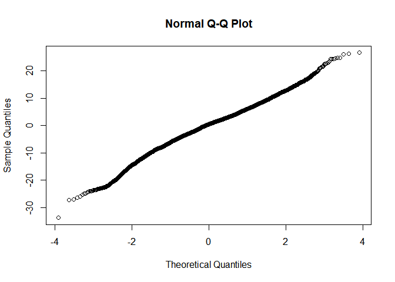

R Notebook
================

-   [Raw Data import](#raw-data-import)
-   [Data manipulation](#data-manipulation)
-   [Model M305](#model-m305)
    -   [Base model](#base-model)
    -   [Full model](#full-model)
    -   [Comparison of baseline and nested model](#comparison-of-baseline-and-nested-model)
    -   [Least square means](#least-square-means)

Raw Data import
===============

``` r
source('../DataImport.R')
```

Data manipulation
=================

``` r
#We inspect the quantile ranges

quantile(AllDataRaw$DaysPregnant)
```

    ##   0%  25%  50%  75% 100% 
    ##  150  275  278  283  297

``` r
AllData <- AllDataRaw %>% dplyr::filter(
                            LactationNumber == 1,
                            DaysPregnant <= 283, #We drop all above 75th percentile because no interest at this stage, missing inseminations?
                            M305 > 0 #No missing M305 calculations
                            ) %>% 
                          dplyr::mutate(
                            Date  = mdy_hms(Date), #reformat ordering date
                            Year = year(mdy_hms(CalvingDate)),
                            Month = month(mdy_hms(CalvingDate)),
                            DaysPregnantQuantile = case_when(
                              DaysPregnant < 267 ~ "0-5th Pct",
                              DaysPregnant < 275 ~ "5-25th Pct",
                              TRUE ~ "25-75 Pct"
                              )
                            ) %>%
                          dplyr::arrange(
                            HerdId,
                            AnimalId,
                            Date
                          ) %>%
                          dplyr::group_by(
                                          AnimalId,
                                          HerdId,
                                          DaysPregnantQuantile,
                                          Year,
                                          Month,
                                          CalvingDate
                                          ) %>% 
                          summarise(
                            Value = as.integer(last(Scale))
                            )
```

Model M305
==========

Base model
----------

``` r
baseline <- lmer(
                  Value ~ 1 +  (1 | HerdId), 
                  data = AllData
                  )
qqnorm(residuals(baseline, type = 'pearson'))
```


Full model
----------

``` r
GLM <- lmer(
                  Value ~ 
                    DaysPregnantQuantile + Year + Month
                     +  (1 | HerdId),
                  data = AllData
                  )
qqnorm(residuals(GLM))
```



Comparison of baseline and nested model
---------------------------------------

``` r
anova(GLM,baseline, test="Chisq")
```

    ## refitting model(s) with ML (instead of REML)

    ## Data: AllData
    ## Models:
    ## baseline: Value ~ 1 + (1 | HerdId)
    ## GLM: Value ~ DaysPregnantQuantile + Year + Month + (1 | HerdId)
    ##          Df   AIC   BIC logLik deviance Chisq Chi Df Pr(>Chisq)    
    ## baseline  3 72494 72516 -36244    72488                            
    ## GLM       7 72404 72455 -36195    72390 98.66      4  < 2.2e-16 ***
    ## ---
    ## Signif. codes:  0 '***' 0.001 '**' 0.01 '*' 0.05 '.' 0.1 ' ' 1

Least square means
------------------

``` r
lsmeans(GLM, pairwise~DaysPregnantQuantile, type = "response", adjust="tukey")
```

    ## Note: D.f. calculations have been disabled because the number of observations exceeds 3000.
    ## To enable adjustments, set emm_options(pbkrtest.limit = 10881) or larger,
    ## but be warned that this may result in large computation time and memory use.

    ## Note: D.f. calculations have been disabled because the number of observations exceeds 3000.
    ## To enable adjustments, set emm_options(lmerTest.limit = 10881) or larger,
    ## but be warned that this may result in large computation time and memory use.

    ## $lsmeans
    ##  DaysPregnantQuantile lsmean    SE  df asymp.LCL asymp.UCL
    ##  0-5th Pct              32.0 0.505 Inf      31.0      33.0
    ##  25-75 Pct              34.4 0.435 Inf      33.6      35.3
    ##  5-25th Pct             33.9 0.452 Inf      33.1      34.8
    ## 
    ## Degrees-of-freedom method: asymptotic 
    ## Confidence level used: 0.95 
    ## 
    ## $contrasts
    ##  contrast               estimate    SE  df z.ratio p.value
    ##  0-5th Pct - 25-75 Pct    -2.440 0.284 Inf -8.587  <.0001 
    ##  0-5th Pct - 5-25th Pct   -1.967 0.307 Inf -6.398  <.0001 
    ##  25-75 Pct - 5-25th Pct    0.473 0.163 Inf  2.895  0.0106 
    ## 
    ## P value adjustment: tukey method for comparing a family of 3 estimates
