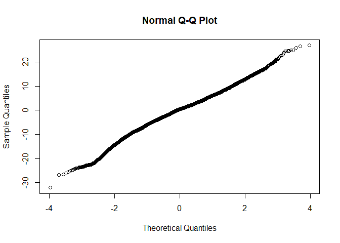

R Notebook for Milkbot SCALE
================

- [Raw Data import](#raw-data-import)
- [Data manipulation](#data-manipulation)
- [Model](#model)
  - [Base model](#base-model)
  - [Full model](#full-model)
  - [Comparison of baseline and nested
    model](#comparison-of-baseline-and-nested-model)
  - [Least square means](#least-square-means)

# Raw Data import

``` r
source('../DataImport.R')
```

# Data manipulation

``` r
#We inspect the quantile ranges
scale_this <- function(x){
  (x - mean(x, na.rm=F)) / sd(x, na.rm=F)
}

quantile(AllDataRaw$DaysPregnant)
```

    ##   0%  25%  50%  75% 100% 
    ##  150  275  278  283  297

``` r
AllData <- AllDataRaw %>% dplyr::filter(
                            LactationNumber == 1,
                            #DaysPregnant <= 283, #We drop all above 75th percentile because no interest at this stage, missing inseminations?
                            M305 > 0 #No missing M305 calculations
                            ) %>% 
                          dplyr::mutate(
                            Date  = mdy_hms(Date), #reformat ordering date
                            Year = year(mdy_hms(CalvingDate)),
                            Month = month(mdy_hms(CalvingDate)),
                            Age = scale(as.numeric(difftime(mdy_hms(CalvingDate), mdy_hms(BirthDate), units = "days"))),
                            DaysPregnantQuantile = case_when(
                              DaysPregnant < 243 ~ "0-1th Pct",
                              DaysPregnant < 267 ~ "1-5th Pct",
                              DaysPregnant < 275 ~ "5-25th Pct",
                              DaysPregnant < 283 ~ "25-75th Pct",
                              TRUE ~ "75-100 Pct"
                              )
                            ) %>%
                          dplyr::arrange(
                            HerdId,
                            AnimalId,
                            Date
                          ) %>%
                          dplyr::group_by(
                                          AnimalId,
                                          HerdId,
                                          DaysPregnantQuantile,
                                          Year,
                                          Month,
                                          CalvingDate,
                                          BirthDate
                                          ) %>% 
                          summarise(
                            Value = as.numeric(last(Scale)),
                            Age = as.numeric(last(Age))
                            ) %>% 
                          tidyr::drop_na() 
```

    ## `summarise()` has grouped output by 'AnimalId', 'HerdId', 'DaysPregnantQuantile', 'Year', 'Month', 'CalvingDate'. You can override using the `.groups`
    ## argument.

``` r
AllData %>% ungroup %>% count(DaysPregnantQuantile)    
```

    ## # A tibble: 5 × 2
    ##   DaysPregnantQuantile     n
    ##   <chr>                <int>
    ## 1 0-1th Pct              129
    ## 2 1-5th Pct              501
    ## 3 25-75th Pct           7214
    ## 4 5-25th Pct            2231
    ## 5 75-100 Pct            3657

# Model

## Base model

``` r
baseline <- lmer(
                  Value ~ 1 +  (1 | HerdId), 
                  data = AllData,
                  REML = FALSE
                  )
qqnorm(residuals(baseline, type = 'pearson'))
```

<!-- -->

## Full model

``` r
GLM <- lmer(
                  Value ~ 
                    DaysPregnantQuantile + Year + Month + DaysPregnantQuantile + Age
                     +  (1 | HerdId),
                  data = AllData,
                  REML = FALSE
                  )
qqnorm(residuals(GLM))
```

<!-- -->

``` r
summary(GLM)
```

    ## Linear mixed model fit by maximum likelihood . t-tests use Satterthwaite's method ['lmerModLmerTest']
    ## Formula: Value ~ DaysPregnantQuantile + Year + Month + DaysPregnantQuantile +      Age + (1 | HerdId)
    ##    Data: AllData
    ## 
    ##      AIC      BIC   logLik deviance df.resid 
    ##  90933.6  91008.9 -45456.8  90913.6    13722 
    ## 
    ## Scaled residuals: 
    ##     Min      1Q  Median      3Q     Max 
    ## -4.9046 -0.5869  0.0661  0.6018  4.1068 
    ## 
    ## Random effects:
    ##  Groups   Name        Variance Std.Dev.
    ##  HerdId   (Intercept) 16.51    4.063   
    ##  Residual             42.91    6.551   
    ## Number of obs: 13732, groups:  HerdId, 89
    ## 
    ## Fixed effects:
    ##                                   Estimate Std. Error         df t value Pr(>|t|)    
    ## (Intercept)                     -1.290e+02  1.038e+02  1.371e+04  -1.243   0.2139    
    ## DaysPregnantQuantile1-5th Pct    1.268e+00  6.593e-01  1.369e+04   1.923   0.0545 .  
    ## DaysPregnantQuantile25-75th Pct  3.452e+00  5.994e-01  1.370e+04   5.760 8.62e-09 ***
    ## DaysPregnantQuantile5-25th Pct   3.005e+00  6.097e-01  1.370e+04   4.928 8.39e-07 ***
    ## DaysPregnantQuantile75-100 Pct   3.468e+00  6.017e-01  1.369e+04   5.763 8.42e-09 ***
    ## Year                             7.986e-02  5.147e-02  1.371e+04   1.552   0.1208    
    ## Month                           -6.510e-02  1.656e-02  1.368e+04  -3.931 8.49e-05 ***
    ## Age                              6.349e-01  6.600e-02  1.371e+04   9.618  < 2e-16 ***
    ## ---
    ## Signif. codes:  0 '***' 0.001 '**' 0.01 '*' 0.05 '.' 0.1 ' ' 1
    ## 
    ## Correlation of Fixed Effects:
    ##             (Intr) DPQ1-P DPQ25P DPQ5-P DPQ75P Year   Month 
    ## DysPrgQ1-5P -0.005                                          
    ## DysPQ25-75P -0.007  0.886                                   
    ## DysPrQ5-25P -0.005  0.870  0.964                            
    ## DyPQ75-100P -0.006  0.879  0.973  0.956                     
    ## Year        -1.000  0.000  0.002 -0.001  0.001              
    ## Month       -0.217 -0.007  0.005  0.002  0.000  0.216       
    ## Age         -0.046 -0.019 -0.010  0.000 -0.024  0.046  0.010

## Comparison of baseline and nested model

``` r
anova(GLM,baseline, test="Chisq")
```

    ## Data: AllData
    ## Models:
    ## baseline: Value ~ 1 + (1 | HerdId)
    ## GLM: Value ~ DaysPregnantQuantile + Year + Month + DaysPregnantQuantile + Age + (1 | HerdId)
    ##          npar   AIC   BIC logLik deviance Chisq Df Pr(>Chisq)    
    ## baseline    3 91122 91145 -45558    91116                        
    ## GLM        10 90934 91009 -45457    90914 202.9  7  < 2.2e-16 ***
    ## ---
    ## Signif. codes:  0 '***' 0.001 '**' 0.01 '*' 0.05 '.' 0.1 ' ' 1

## Least square means

``` r
emm_options(pbkrtest.limit = 10880)
LSMs<-emmeans::emmeans(GLM, pairwise~DaysPregnantQuantile, type = "response", adjust="sidak", glhargs=list())
```

    ## Note: D.f. calculations have been disabled because the number of observations exceeds 10880.
    ## To enable adjustments, add the argument 'pbkrtest.limit = 13732' (or larger)
    ## [or, globally, 'set emm_options(pbkrtest.limit = 13732)' or larger];
    ## but be warned that this may result in large computation time and memory use.

    ## Note: D.f. calculations have been disabled because the number of observations exceeds 3000.
    ## To enable adjustments, add the argument 'lmerTest.limit = 13732' (or larger)
    ## [or, globally, 'set emm_options(lmerTest.limit = 13732)' or larger];
    ## but be warned that this may result in large computation time and memory use.

``` r
multcomp::cld(LSMs$emmeans, alpha=0.05, Letters=letters, adjust="sidak")
```

    ##  DaysPregnantQuantile emmean    SE  df asymp.LCL asymp.UCL .group
    ##  0-1th Pct              31.5 0.734 Inf      29.6      33.4  a    
    ##  1-5th Pct              32.8 0.528 Inf      31.4      34.1  a    
    ##  5-25th Pct             34.5 0.460 Inf      33.3      35.7   b   
    ##  25-75th Pct            34.9 0.446 Inf      33.8      36.1   b   
    ##  75-100 Pct             35.0 0.451 Inf      33.8      36.1   b   
    ## 
    ## Degrees-of-freedom method: asymptotic 
    ## Confidence level used: 0.95 
    ## Conf-level adjustment: sidak method for 5 estimates 
    ## P value adjustment: sidak method for 10 tests 
    ## significance level used: alpha = 0.05 
    ## NOTE: If two or more means share the same grouping symbol,
    ##       then we cannot show them to be different.
    ##       But we also did not show them to be the same.
