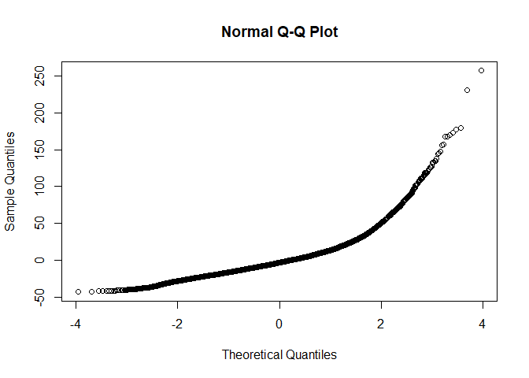

R Notebook for TIMETOPEAK
================

- [Raw Data import](#raw-data-import)
- [Data manipulation](#data-manipulation)
- [Model](#model)
  - [Base model](#base-model)
  - [Full model](#full-model)
  - [Comparison of baseline and nested
    model](#comparison-of-baseline-and-nested-model)
  - [Least square means](#least-square-means)

# Raw Data import

``` r
source('../DataImport.R')
```

# Data manipulation

``` r
#We inspect the quantile ranges
scale_this <- function(x){
  (x - mean(x, na.rm=F)) / sd(x, na.rm=F)
}

quantile(AllDataRaw$DaysPregnant)
```

    ##   0%  25%  50%  75% 100% 
    ##  150  275  278  283  297

``` r
AllData <- AllDataRaw %>% dplyr::filter(
                            LactationNumber == 1,
                            DaysPregnant <= 283, #We drop all above 75th percentile because no interest at this stage, missing inseminations?
                            M305 > 0 #No missing M305 calculations
                            ) %>% 
                          dplyr::mutate(
                            Date  = mdy_hms(Date), #reformat ordering date
                            Year = year(mdy_hms(CalvingDate)),
                            Month = month(mdy_hms(CalvingDate)),
                            Age = scale(as.numeric(difftime(mdy_hms(CalvingDate), mdy_hms(BirthDate), units = "days"))),
                            DaysPregnantQuantile = case_when(
                              DaysPregnant < 243 ~ "0-1th Pct",
                              DaysPregnant < 267 ~ "1-5th Pct",
                              DaysPregnant < 275 ~ "5-25th Pct",
                              TRUE ~ "25-75 Pct"
                              )
                            ) %>%
                          dplyr::arrange(
                            HerdId,
                            AnimalId,
                            Date
                          ) %>%
                          dplyr::group_by(
                                          AnimalId,
                                          HerdId,
                                          DaysPregnantQuantile,
                                          Year,
                                          Month,
                                          CalvingDate,
                                          BirthDate
                                          ) %>% 
                          summarise(
                            Value = as.numeric(last(TimeToPeak)),
                            Age = as.numeric(last(Age))
                            ) %>% 
                          tidyr::drop_na() 
```

    ## `summarise()` has grouped output by 'AnimalId', 'HerdId',
    ## 'DaysPregnantQuantile', 'Year', 'Month', 'CalvingDate'. You can override using
    ## the `.groups` argument.

``` r
AllData %>% ungroup %>% count(DaysPregnantQuantile)    
```

    ## # A tibble: 4 × 2
    ##   DaysPregnantQuantile     n
    ##   <chr>                <int>
    ## 1 0-1th Pct              124
    ## 2 1-5th Pct              487
    ## 3 25-75 Pct             7830
    ## 4 5-25th Pct            2174

# Model

## Base model

``` r
baseline <- lmer(
                  Value ~ 1 +  (1 | HerdId), 
                  data = AllData,
                  REML = FALSE
                  )
qqnorm(residuals(baseline, type = 'pearson'))
```

<!-- -->

## Full model

``` r
GLM <- lmer(
                  Value ~ 
                    DaysPregnantQuantile + Year + Month + DaysPregnantQuantile + Age
                     +  (1 | HerdId),
                  data = AllData,
                  REML = FALSE
                  )
qqnorm(residuals(GLM))
```

<!-- -->

``` r
summary(GLM)
```

    ## Linear mixed model fit by maximum likelihood . t-tests use Satterthwaite's
    ##   method [lmerModLmerTest]
    ## Formula: Value ~ DaysPregnantQuantile + Year + Month + DaysPregnantQuantile +  
    ##     Age + (1 | HerdId)
    ##    Data: AllData
    ## 
    ##      AIC      BIC   logLik deviance df.resid 
    ##  93893.5  93958.9 -46937.8  93875.5    10606 
    ## 
    ## Scaled residuals: 
    ##     Min      1Q  Median      3Q     Max 
    ## -2.1013 -0.6061 -0.1455  0.3781 12.8120 
    ## 
    ## Random effects:
    ##  Groups   Name        Variance Std.Dev.
    ##  HerdId   (Intercept)  44.01    6.634  
    ##  Residual             398.28   19.957  
    ## Number of obs: 10615, groups:  HerdId, 89
    ## 
    ## Fixed effects:
    ##                                  Estimate Std. Error         df t value
    ## (Intercept)                     1.283e+03  3.589e+02  9.723e+03   3.573
    ## DaysPregnantQuantile1-5th Pct  -8.059e-01  2.066e+00  1.053e+04  -0.390
    ## DaysPregnantQuantile25-75 Pct  -4.096e+00  1.886e+00  1.035e+04  -2.171
    ## DaysPregnantQuantile5-25th Pct -3.628e+00  1.919e+00  1.038e+04  -1.891
    ## Year                           -5.970e-01  1.780e-01  9.725e+03  -3.354
    ## Month                           3.440e-01  5.753e-02  1.060e+04   5.979
    ## Age                            -7.480e-01  2.296e-01  1.059e+04  -3.258
    ##                                Pr(>|t|)    
    ## (Intercept)                    0.000354 ***
    ## DaysPregnantQuantile1-5th Pct  0.696490    
    ## DaysPregnantQuantile25-75 Pct  0.029925 *  
    ## DaysPregnantQuantile5-25th Pct 0.058694 .  
    ## Year                           0.000799 ***
    ## Month                          2.31e-09 ***
    ## Age                            0.001124 ** 
    ## ---
    ## Signif. codes:  0 '***' 0.001 '**' 0.01 '*' 0.05 '.' 0.1 ' ' 1
    ## 
    ## Correlation of Fixed Effects:
    ##             (Intr) DPQ1-P DPQ25P DPQ5-P Year   Month 
    ## DysPrgQ1-5P -0.011                                   
    ## DysPQ25-75P -0.014  0.889                            
    ## DysPrQ5-25P -0.011  0.873  0.966                     
    ## Year        -1.000  0.006  0.009  0.006              
    ## Month       -0.214 -0.008  0.004  0.002  0.213       
    ## Age         -0.061 -0.023 -0.016 -0.003  0.061  0.008

## Comparison of baseline and nested model

``` r
anova(GLM,baseline, test="Chisq")
```

    ## Data: AllData
    ## Models:
    ## baseline: Value ~ 1 + (1 | HerdId)
    ## GLM: Value ~ DaysPregnantQuantile + Year + Month + DaysPregnantQuantile + Age + (1 | HerdId)
    ##          npar   AIC   BIC logLik deviance  Chisq Df Pr(>Chisq)    
    ## baseline    3 93966 93988 -46980    93960                         
    ## GLM         9 93894 93959 -46938    93876 84.219  6   4.79e-16 ***
    ## ---
    ## Signif. codes:  0 '***' 0.001 '**' 0.01 '*' 0.05 '.' 0.1 ' ' 1

## Least square means

``` r
emm_options(pbkrtest.limit = 10880)
LSMs<-emmeans::emmeans(GLM, pairwise~DaysPregnantQuantile, type = "response", adjust="sidak", glhargs=list())
multcomp::cld(LSMs$emmeans, alpha=0.05, Letters=letters, adjust="sidak")
```

    ##  DaysPregnantQuantile emmean    SE     df lower.CL upper.CL .group
    ##  25-75 Pct              77.4 0.784   92.8     75.4     79.4  a    
    ##  5-25th Pct             77.9 0.868  139.4     75.7     80.1  a    
    ##  1-5th Pct              80.7 1.178  472.6     77.8     83.7   b   
    ##  0-1th Pct              81.5 1.996 2679.4     76.5     86.5  ab   
    ## 
    ## Degrees-of-freedom method: kenward-roger 
    ## Confidence level used: 0.95 
    ## Conf-level adjustment: sidak method for 4 estimates 
    ## P value adjustment: sidak method for 6 tests 
    ## significance level used: alpha = 0.05 
    ## NOTE: If two or more means share the same grouping symbol,
    ##       then we cannot show them to be different.
    ##       But we also did not show them to be the same.
