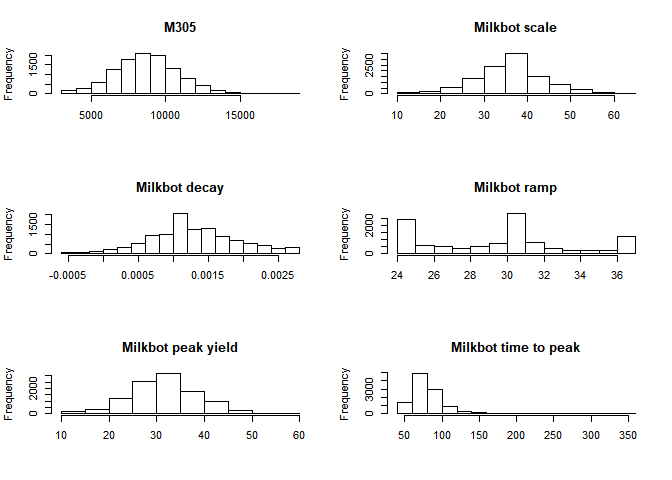

R Notebook for short gestation heifer paper
================

-   [R Setup](#r-setup)
-   [Raw Data import](#raw-data-import)
-   [Data manipulation](#data-manipulation)
-   [Basic data exploration](#basic-data-exploration)
-   [Basid data visualisation](#basid-data-visualisation)
-   [Models build](#models-build)

R Setup
=======

``` r
#data manipulation
if (!require("dplyr")) {
  install.packages("dplyr", dependencies = TRUE)
  library(dplyr)
}
```

    ## Loading required package: dplyr

    ## 
    ## Attaching package: 'dplyr'

    ## The following objects are masked from 'package:stats':
    ## 
    ##     filter, lag

    ## The following objects are masked from 'package:base':
    ## 
    ##     intersect, setdiff, setequal, union

``` r
#drop_na
if (!require("tidyr")) {
  install.packages("tidyr", dependencies = TRUE)
  library(tidyr)
}
```

    ## Loading required package: tidyr

``` r
#%LIKE%
if (!require("data.table")) {
  install.packages("data.table", dependencies = TRUE)
  library(data.table)
}
```

    ## Loading required package: data.table

    ## 
    ## Attaching package: 'data.table'

    ## The following objects are masked from 'package:dplyr':
    ## 
    ##     between, first, last

``` r
#glmer
if (!require("lme4")){install.packages("lme4", dependencies = TRUE)
  library(lme4)
}
```

    ## Loading required package: lme4

    ## Loading required package: Matrix

    ## 
    ## Attaching package: 'Matrix'

    ## The following object is masked from 'package:tidyr':
    ## 
    ##     expand

``` r
#lsmeans
if (!require("lsmeans")){install.packages("lsmeans", dependencies = TRUE)
  library(lsmeans)
}
```

    ## Loading required package: lsmeans

    ## Loading required package: emmeans

    ## The 'lsmeans' package is now basically a front end for 'emmeans'.
    ## Users are encouraged to switch the rest of the way.
    ## See help('transition') for more information, including how to
    ## convert old 'lsmeans' objects and scripts to work with 'emmeans'.

``` r
#lsmeans
if (!require("lubridate")){install.packages("lsmeans", dependencies = TRUE)
  library(lubridate)
}
```

    ## Loading required package: lubridate

    ## 
    ## Attaching package: 'lubridate'

    ## The following objects are masked from 'package:data.table':
    ## 
    ##     hour, isoweek, mday, minute, month, quarter, second, wday,
    ##     week, yday, year

    ## The following object is masked from 'package:base':
    ## 
    ##     date

Raw Data import
===============

``` r
#data manipulation
if (!require("dplyr")) {
  install.packages("dplyr", dependencies = TRUE)
  library(dplyr)
}

if(!(exists('AllDataRaw') && is.data.frame(get('AllDataRaw')))) {
  AllDataRaw <- read.csv2(file = "./Data/TableauExportv2.csv", 
                          header = T,
                          strip.white = TRUE,
                          dec = ".",
                          sep = ',', na.strings = c('', 'NA')
  )
  oldColumns <- names(AllDataRaw)
  newColumns <- gsub("\\.",    "", oldColumns, perl=TRUE)
  #Strange name for AnimalId
  newColumns[1] <- "AnimalId"
  #Duplicate name for DaysInMilk
  newColumns[19] <- "DaysInMilkBin"
  names(AllDataRaw) <- newColumns
  AllDataRaw <- AllDataRaw %>% 
    dplyr::arrange(
      HerdId,
      AnimalId,
      Date
    )
}
```

Data manipulation
=================

``` r
#We inspect the quantile ranges

quantile(AllDataRaw$DaysPregnant)
```

    ##   0%  25%  50%  75% 100% 
    ##  150  275  278  283  297

``` r
AllData <- AllDataRaw %>% dplyr::filter(
                            LactationNumber == 1,
                            DaysPregnant <= 283, #We drop all above 75th percentile because no interest at this stage, missing inseminations?
                            M305 > 0 #No missing M305 calculations
                            ) %>% 
                          dplyr::mutate(
                            Date  = mdy_hms(Date), #reformat ordering date
                            Year = year(mdy_hms(CalvingDate)),
                            Month = month(mdy_hms(CalvingDate)),
                            DaysPregnantQuantile = case_when(
                              DaysPregnant < 275 ~ "0-25th Pct",
                              TRUE ~ "25-75 Pct"
                              )
                            ) %>%
                          dplyr::arrange(
                            HerdId,
                            AnimalId,
                            Date
                          ) %>%
                          dplyr::group_by(
                                          AnimalId,
                                          HerdId,
                                          DaysPregnantQuantile,
                                          Year,
                                          Month,
                                          CalvingDate
                                          ) %>% 
                          summarise(
                            lastM305 = as.integer(last(M305)),
                            lastDIM = as.integer(last(DaysInMilk)),
                            lastScale = as.numeric(last(Scale)),
                            lastDecay = as.numeric(last(Decay)),
                            lastRamp = as.numeric(last(Ramp)),
                            lastPeakYield = as.numeric(last(PeakMilk)),
                            lastTimeToPeak = as.integer(last(TimeToPeak))
                            )
```

Basic data exploration
======================

``` r
summary(AllData[,c("lastM305",
                   "lastDecay",
                   "lastRamp",
                   "lastScale",
                   "lastPeakYield",
                   "lastTimeToPeak")])
```

    ##     lastM305       lastDecay            lastRamp       lastScale    
    ##  Min.   : 3044   Min.   :-0.000471   Min.   :24.77   Min.   :14.50  
    ##  1st Qu.: 7336   1st Qu.: 0.000863   1st Qu.:25.54   1st Qu.:31.69  
    ##  Median : 8711   Median : 0.001221   Median :30.41   Median :38.03  
    ##  Mean   : 8688   Mean   : 0.001281   Mean   :29.62   Mean   :36.21  
    ##  3rd Qu.:10004   3rd Qu.: 0.001654   3rd Qu.:31.32   3rd Qu.:40.25  
    ##  Max.   :18384   Max.   : 0.002703   Max.   :36.67   Max.   :61.85  
    ##                                                                     
    ##  lastPeakYield   lastTimeToPeak  
    ##  Min.   :12.00   Min.   : 52.00  
    ##  1st Qu.:27.60   1st Qu.: 66.00  
    ##  Median :32.50   Median : 77.00  
    ##  Mean   :31.86   Mean   : 80.48  
    ##  3rd Qu.:35.80   3rd Qu.: 89.00  
    ##  Max.   :56.10   Max.   :348.00  
    ##  NA's   :265     NA's   :265

Basid data visualisation
========================

``` r
op = par(mfrow=c(3, 2))
hist(AllData$lastM305,
     main = "M305", xlab="")
hist(AllData$lastScale,
     main = "Milkbot scale", xlab="")
hist(AllData$lastDecay,
     main = "Milkbot decay", xlab="")
hist(AllData$lastRamp,
     main = "Milkbot ramp", xlab="")
hist(AllData$lastPeakYield,
     main = "Milkbot peak yield", xlab="")
hist(AllData$lastTimeToPeak,
     main = "Milkbot time to peak", xlab="")
```



Models build
============

-   [Link to model M305](Models/M305)
-   [Link to model Scale](Models/Scale)
-   [Link to model Decay](Models/Decay)
-   [Link to model Ramp](Models/Ramp.md)
-   [Link to model Peak Yield](Models/PeakYield.md)
-   [Link to model Time To Peak](Models/TimeToPeak.md)
