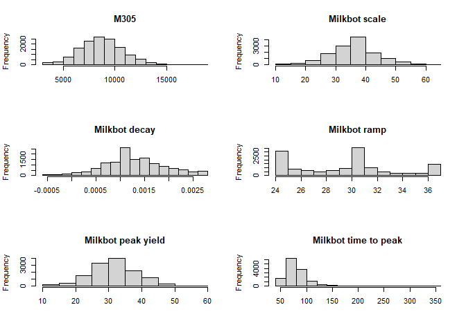

R Notebook for short gestation heifer paper
================

- [R Setup](#r-setup)
- [Raw Data import](#raw-data-import)
- [Data manipulation](#data-manipulation)
  - [Descriptives](#descriptives)
- [Basic data exploration](#basic-data-exploration)
- [Basic data visualisation](#basic-data-visualisation)
- [Models build](#models-build)

# R Setup

``` r
# List of packages for session
.packages = c("ggplot2",
                  "dplyr",
                  "tidyr",                
                  "lme4",
                  "lmerTest",
                  "multcompView",
                  "multcomp",
                  "emmeans",
                  "lsmeans",
                  "TH.data",
                  "car",
                  "lubridate"
              )

# Install CRAN packages (if not already installed)
.inst <- .packages %in% installed.packages()
if(length(.packages[!.inst]) > 0) install.packages(.packages[!.inst], repos = "http://cran.us.r-project.org", dependencies = TRUE)

# Load packages into session
lapply(.packages, require, character.only=TRUE, quietly = TRUE)
```

    ## [[1]]
    ## [1] TRUE
    ## 
    ## [[2]]
    ## [1] TRUE
    ## 
    ## [[3]]
    ## [1] TRUE
    ## 
    ## [[4]]
    ## [1] TRUE
    ## 
    ## [[5]]
    ## [1] TRUE
    ## 
    ## [[6]]
    ## [1] TRUE
    ## 
    ## [[7]]
    ## [1] TRUE
    ## 
    ## [[8]]
    ## [1] TRUE
    ## 
    ## [[9]]
    ## [1] TRUE
    ## 
    ## [[10]]
    ## [1] TRUE
    ## 
    ## [[11]]
    ## [1] TRUE
    ## 
    ## [[12]]
    ## [1] TRUE

# Raw Data import

``` r
if(!(exists('AllDataRaw') && is.data.frame(get('AllDataRaw')))) {
  AllDataRaw <- read.csv2(file = "./Data/TableauExportv2.csv", 
                          header = T,
                          strip.white = TRUE,
                          dec = ".",
                          sep = ',', na.strings = c('', 'NA')
  )
  oldColumns <- names(AllDataRaw)
  newColumns <- gsub("\\.",    "", oldColumns, perl=TRUE)
  #Strange name for AnimalId
  newColumns[1] <- "AnimalId"
  #Duplicate name for DaysInMilk
  newColumns[19] <- "DaysInMilkBin"
  names(AllDataRaw) <- newColumns
  AllDataRaw <- AllDataRaw %>% 
    dplyr::arrange(
      HerdId,
      AnimalId,
      Date
    )
}
```

# Data manipulation

## Descriptives

``` r
AllDataUngrouped <- AllDataRaw %>% dplyr::filter(
                            LactationNumber == 1,
                            # DaysPregnant <= 283, #We drop all above 75th percentile because no interest at this stage, missing inseminations?
                            M305 > 0 #No missing M305 calculations
                            )
AllDataUngrouped %>% count()
```

    ##         n
    ## 1 2124486

``` r
AllDataUngrouped %>% summarise(count = n_distinct(AnimalId))
```

    ##   count
    ## 1 13735

``` r
AllDataUngrouped %>% summarise(count = n_distinct(HerdId))
```

    ##   count
    ## 1    89

``` r
#We inspect the quantile ranges

quantile(AllDataRaw$DaysPregnant, c(0,0.001, 0.01, 0.05, 0.25,0.50,0.75,1))
```

    ##   0% 0.1%   1%   5%  25%  50%  75% 100% 
    ##  150  172  243  267  275  278  283  297

``` r
AllData <- AllDataRaw %>% dplyr::filter(
                            LactationNumber == 1,
                            # DaysPregnant <= 283, #We drop all above 75th percentile because no interest at this stage, missing inseminations?
                            M305 > 0 #No missing M305 calculations
                            ) %>% 
                          dplyr::mutate(
                            Date  = mdy_hms(Date), #reformat ordering date
                            Year = year(mdy_hms(CalvingDate)),
                            Month = month(mdy_hms(CalvingDate)),
                            DaysPregnantQuantile = case_when(
                              DaysPregnant < 243 ~ "0-1th Pct",
                              DaysPregnant < 267 ~ "1-25th Pct",
                              DaysPregnant < 283 ~ "25-75th Pct",
                              TRUE ~ "75-100 Pct"
                              )
                            ) %>%
                          dplyr::arrange(
                            HerdId,
                            AnimalId,
                            Date
                          ) %>%
                          dplyr::group_by(
                                          AnimalId,
                                          HerdId,
                                          DaysPregnantQuantile,
                                          Year,
                                          Month,
                                          CalvingDate
                                          ) %>% 
                          summarise(
                            lastM305 = as.integer(last(M305)),
                            lastDIM = as.integer(last(DaysInMilk)),
                            lastScale = as.numeric(last(Scale)),
                            lastDecay = as.numeric(last(Decay)),
                            lastRamp = as.numeric(last(Ramp)),
                            lastPeakYield = as.numeric(last(PeakMilk)),
                            lastTimeToPeak = as.integer(last(TimeToPeak))
                            )
```

    ## `summarise()` has grouped output by 'AnimalId', 'HerdId', 'DaysPregnantQuantile', 'Year', 'Month'. You can override using the `.groups` argument.

# Basic data exploration

``` r
summary(AllData[,c("lastM305",
                   "lastDecay",
                   "lastRamp",
                   "lastScale",
                   "lastPeakYield",
                   "lastTimeToPeak")])
```

    ##     lastM305       lastDecay            lastRamp       lastScale     lastPeakYield   lastTimeToPeak  
    ##  Min.   : 3044   Min.   :-0.000471   Min.   :24.77   Min.   :14.50   Min.   :11.90   Min.   : 52.00  
    ##  1st Qu.: 7304   1st Qu.: 0.000893   1st Qu.:25.42   1st Qu.:31.61   1st Qu.:27.50   1st Qu.: 66.00  
    ##  Median : 8682   Median : 0.001239   Median :30.34   Median :38.03   Median :32.40   Median : 76.00  
    ##  Mean   : 8667   Mean   : 0.001297   Mean   :29.54   Mean   :36.20   Mean   :31.81   Mean   : 79.93  
    ##  3rd Qu.:10004   3rd Qu.: 0.001682   3rd Qu.:31.20   3rd Qu.:40.23   3rd Qu.:35.70   3rd Qu.: 88.00  
    ##  Max.   :18384   Max.   : 0.002703   Max.   :36.67   Max.   :61.88   Max.   :56.10   Max.   :348.00  
    ##                                                                      NA's   :318     NA's   :318

# Basic data visualisation

``` r
op = par(mfrow=c(3, 2))
hist(AllData$lastM305,
     main = "M305", xlab="")
hist(AllData$lastScale,
     main = "Milkbot scale", xlab="")
hist(AllData$lastDecay,
     main = "Milkbot decay", xlab="")
hist(AllData$lastRamp,
     main = "Milkbot ramp", xlab="")
hist(AllData$lastPeakYield,
     main = "Milkbot peak yield", xlab="")
hist(AllData$lastTimeToPeak,
     main = "Milkbot time to peak", xlab="")
```

<!-- -->

# Models build

- [Link to model M305](Models/M305.md)
- [Link to model Scale](Models/Scale.md)
- [Link to model Decay](Models/Decay.md)
- [Link to model Ramp](Models/Ramp.md)
- [Link to model Peak Yield](Models/PeakYield.md)
- [Link to model Time To Peak](Models/TimeToPeak.md)
